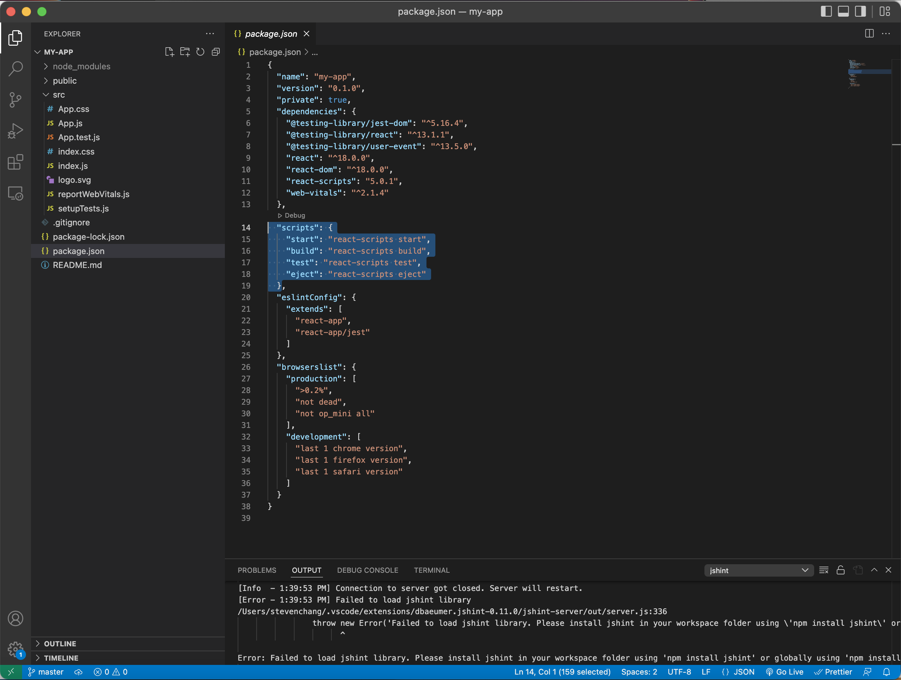
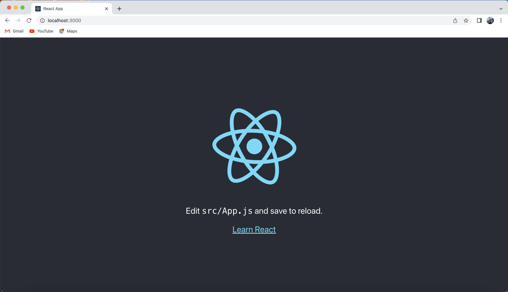

# Reactjs

[Official Doc](https://reactjs.org/)

## Table of Content
### 1. [Intro](#intro)
### 2. [Set up](#set-up)
### 3. [Layout](#layout)
### 4. [JSX](#jsx)
### 5. [Components](#components)
* [Props](#props)
* [Lifecycle](#lifecycle)
* [Hooks](#hooks)
* [Event](#event)
### 6. [Styling](#styling)
### 7. [Webpack](#webpack)

## Intro

React is a front-end JavaScript library for building user interfaces, and currently it's one of the most popular frameworks in the communities, others are Vuejs, Angular and svelte etc.

The main characteristic of React is it encourage developers to write pure functional code and make use of the concept of functional programming, and it also supports mobile app development (React Native) which you can learn more in [this doc](https://reactnative.dev/), but in this program, we will be focusing on React

## Set up

To create an react project, after installing nodejs and npm, simply run:
```
npx create-react-app my-app
```
This will create a react project called ```my-app```

On VS code, you will see the following file system


Don't get scared away, the important file that you need to focusing on is ```package.json``` and ```src``` folder.

```src``` folder is the source folder, most of your code will be written here, the code starts from ```index.js``` with the root components as ```App.js``` and then your code will be expand from here. For more information, you will learn in the [Components](components) section

```package.json``` contains the project information such as all the installed libraries information and scripts that you can run, for example to start the local host server, you can run ```npm run start``` in the terminal.

After running ```npm run start```, you should see the following

And it is running on ```http://localhost:3000``` which is our local host server

## Layout

Now we will look closely into ```index.js``` and ```App.js```. ```index.js``` is shown as follow:
```
//index.js
import React from 'react';
import ReactDOM from 'react-dom/client';
import './index.css';
import App from './App';
import reportWebVitals from './reportWebVitals';

const root = ReactDOM.createRoot(document.getElementById('root'));
root.render(
  <React.StrictMode>
    <App />
  </React.StrictMode>
);

reportWebVitals();
```

Notice the ```root``` object, we can see there is a DOM operation as an argument being passed into ```ReactDOM.createRoot()``` function. To understand this, let's take a look of the ```index.html``` file in the ```public``` folder:

```
<!DOCTYPE html>
<html lang="en">
  <head>
    <meta charset="utf-8" />
    <link rel="icon" href="%PUBLIC_URL%/favicon.ico" />
    <meta name="viewport" content="width=device-width, initial-scale=1" />
    <meta name="theme-color" content="#000000" />
    <meta
      name="description"
      content="Web site created using create-react-app"
    />
    <link rel="apple-touch-icon" href="%PUBLIC_URL%/logo192.png" />
    <link rel="manifest" href="%PUBLIC_URL%/manifest.json" />
    <title>React App</title>
  </head>
  <body>
    <noscript>You need to enable JavaScript to run this app.</noscript>
    <div id="root"></div>
  </body>
</html>

```

Notice in the ```body``` there's a ```<div></div>``` with ```id="root"```. Therefore, ```ReactDOM.createRoot(document.getElementById('root'));``` basically means whatever the contents we wrote in ```root```, it will be injected into the empty ```<div>``` tag. In this case is the content inside ```App.js```, and if we change the content in ```App.js``` as
```
//App.js
const App = () => {
  return (
    <div className="App">
      <p>Hello</p>
    </div>
  );
}

export default App;
```
You will see the following


This is basically how React works

## JSX
Taking the ```App.js``` code above as an example, JSX is a html-like syntax that is being used in React, they have some syntax difference. For example ```class``` attribute in HTML becomes ```className``` in JSX, and JSX also combines the functionality of eventlistener for example JSX has ```onClick``` attribute which is basically ```addEventListener('click',()=>{})```. We will be using JSX extensively when writing React.

## Components
```App.js``` itself is a component in React, and when importing ```App``` component into other file or component, it will becomes a tag like normal HTML tag.

For example when importing ```App``` component into ```index.js```, you can see they use the syntax ```<App />``` it is called self closing tag.


## Tutorial (Optional)

[Tutorial](https://www.youtube.com/watch?v=TlB_eWDSMt4)
